# Inkscapeの設定と操作方法

## インストール
[**Inkscape公式サイト**](https://inkscape.org/)から  
Download > Crrrent Version > 自分のOS用を選択(Win/Mac/Lin)

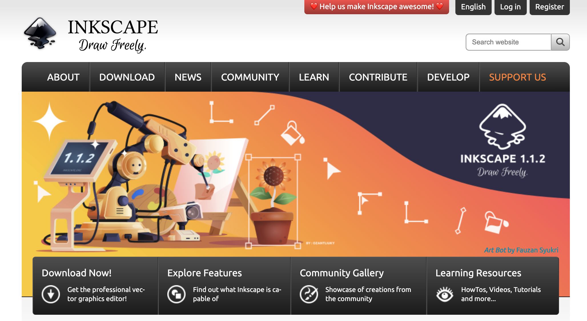

Inkscapeを開いた時の初期画面(A4サイズ)
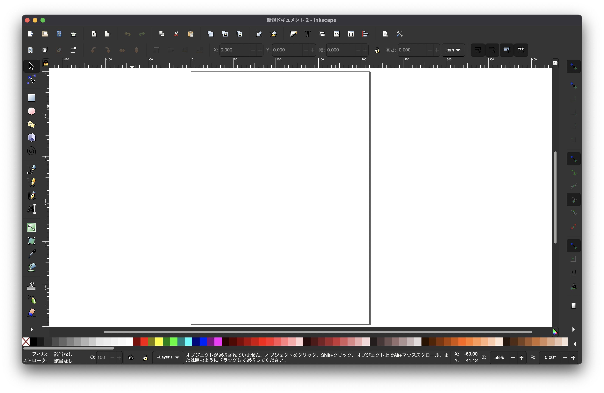

## 画面サイズ変更
レーザーカッター用に画面サイズを(600mm x 300mm)変更します。

メニューの**ファイル**から**ドキュメントのプロパティ**を選択します。
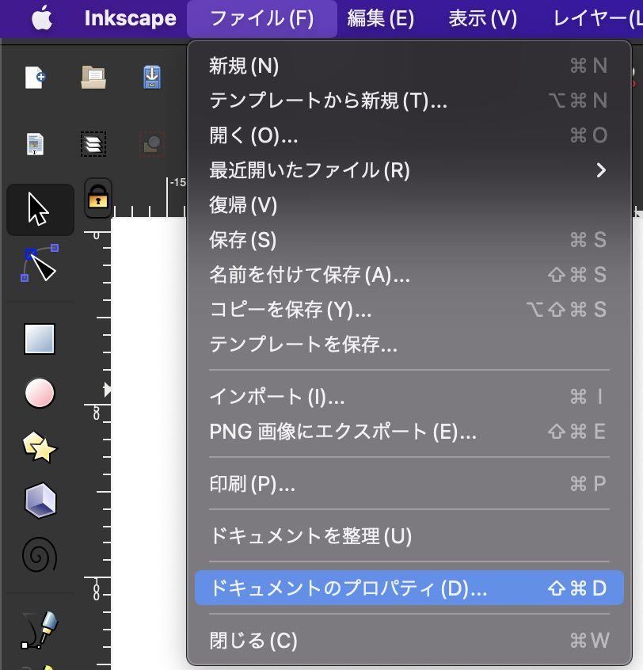

ページサイズ一覧の下にカスタムサイズを設定できる欄があるので、方向を横にして、サイズを**横600、縦300**に設定しましょう。そして単位を必ず**mm(ミリメートル)**にしましょう。
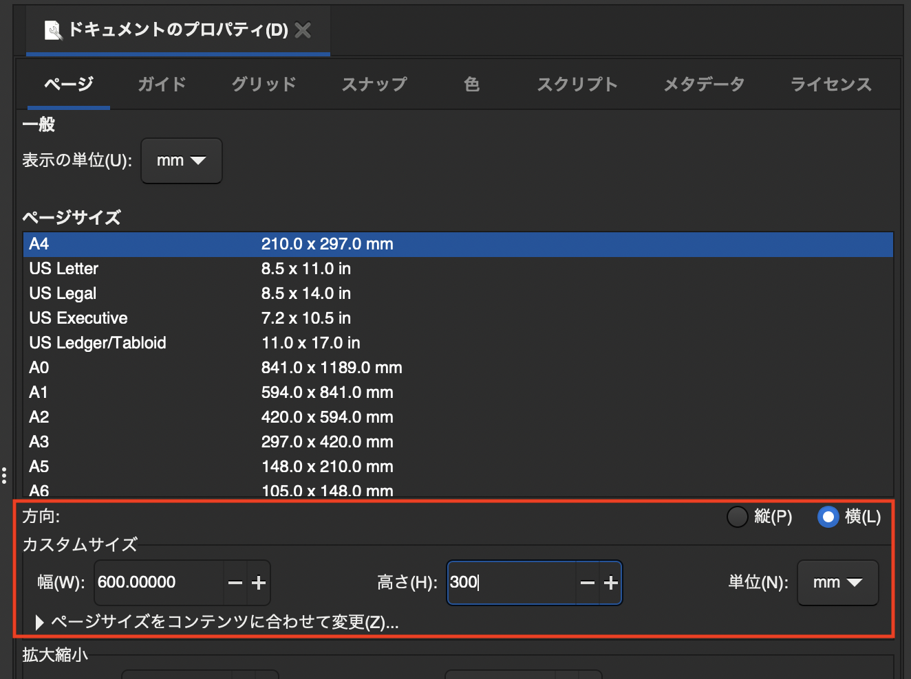

すると、横長の画面に変更されます。
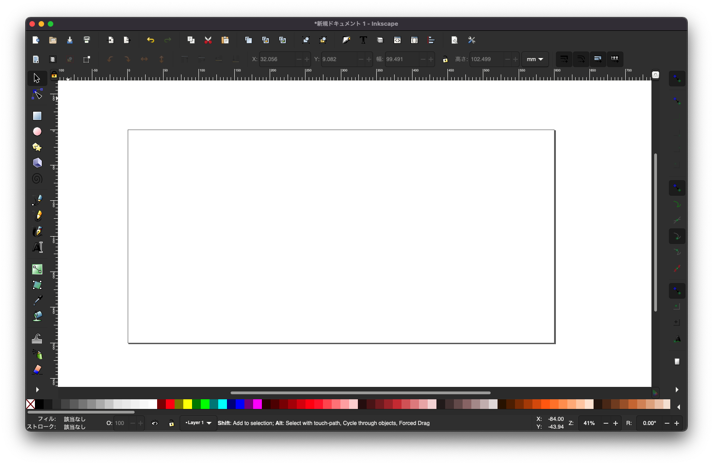

## Inkscapeの操作方法

Inkscapeでよく使うマウス操作を載せておきます。

- 画面縦スクロール：マウスホイール
- 画面横スクロール：Shift + マウスホイール
- ズームイン：マウスホイールクリック
- ズームアウト：Shift + マウスホイールクリック
- 選択ツール：s ボタン

## 基本図形の生成

左サイドバーにある円形や四角を選択し、キャンバス上でドラッグすることで、
図形を作成できます。
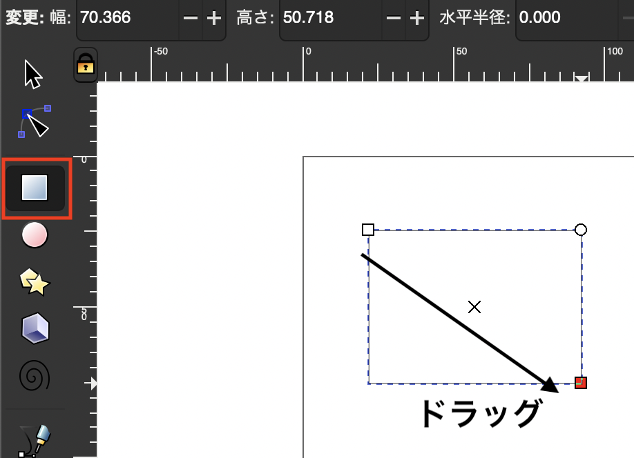

## 塗りと線の設定
作成した図形を選択すると、画面左下から図形の**塗りと線**の状態がみれます。
現在の状態は、**フィル(塗り)なし、ストローク黒、太さ0.265**になっています。

印刷するときは塗り無しの線の太さを0.1に設定します。
線の太さや、塗りを変更する場合は、このフィル、ストロークをクリックします。
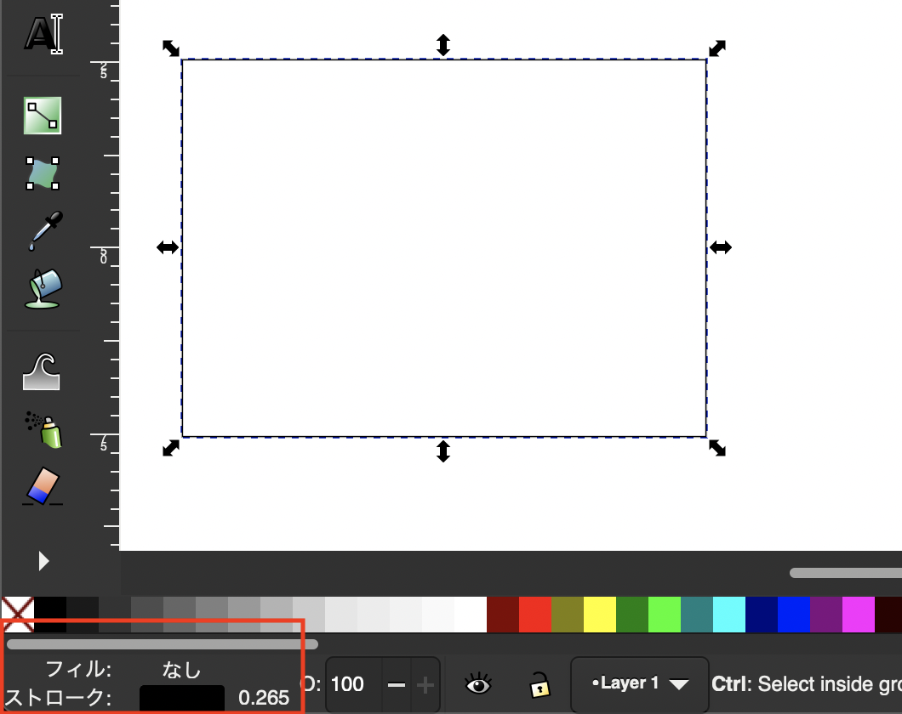

フィルストローク設定が開きますので、
以下のような設定になっているか確認しましょう。  
フィル：塗りなし
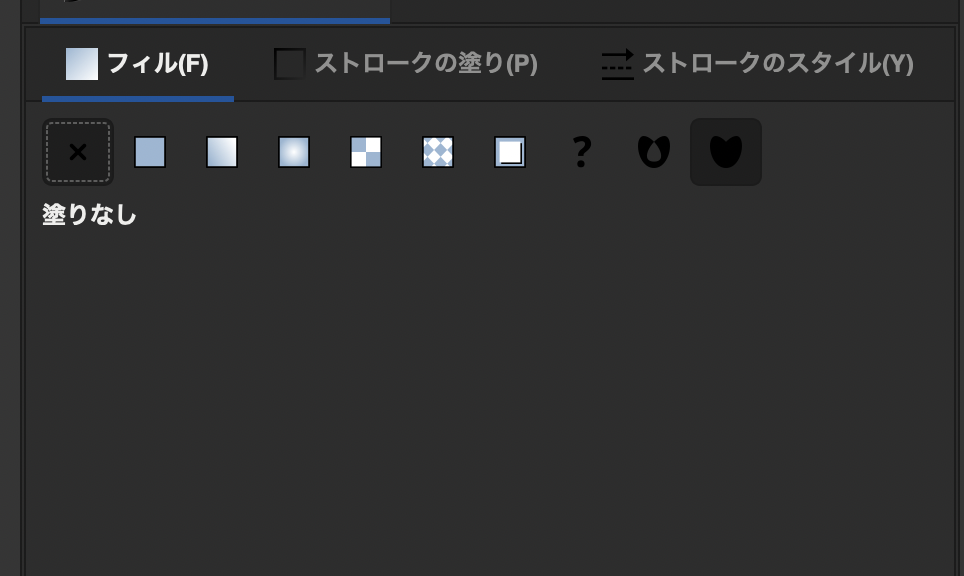

ストローク：単一色
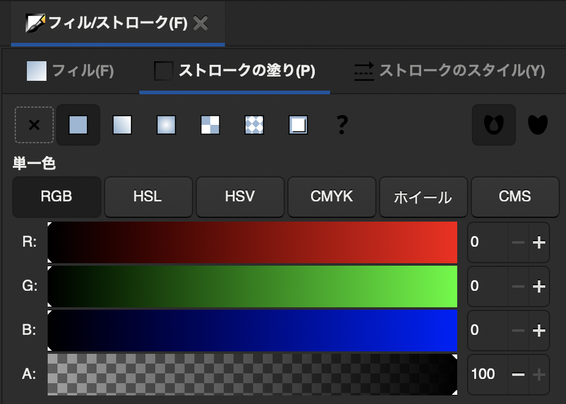

ストロークのスタイル：幅0.1
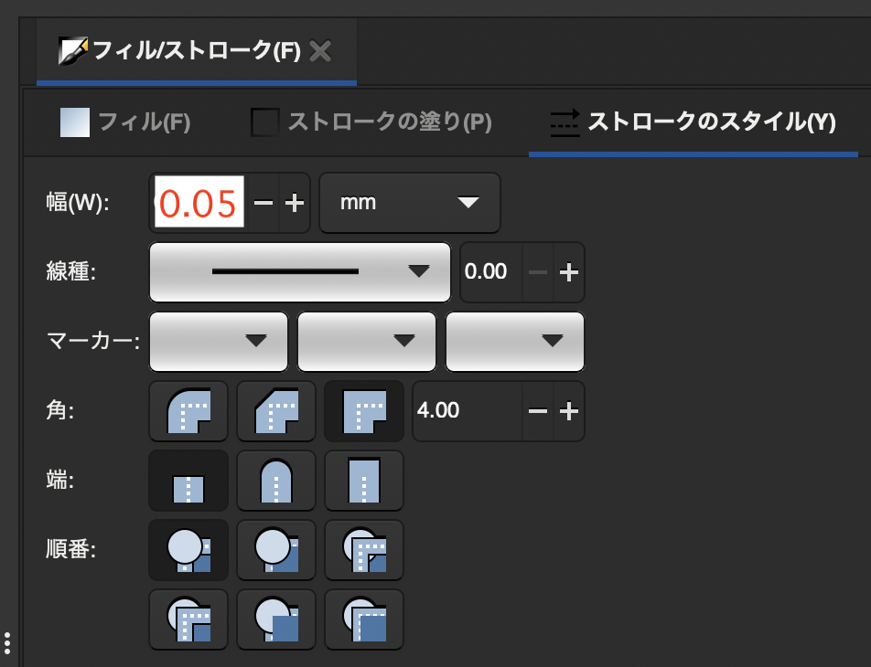

## 保存

最後にファイルから**名前をつけて保存**で[適当な名前+**.pdf**]をつけて保存しましょう。
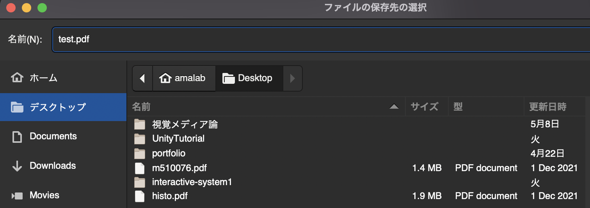

